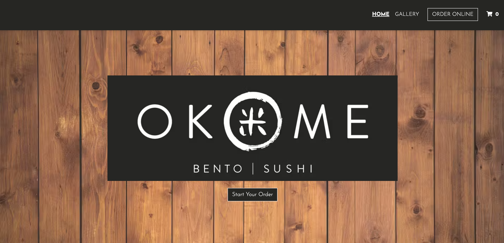
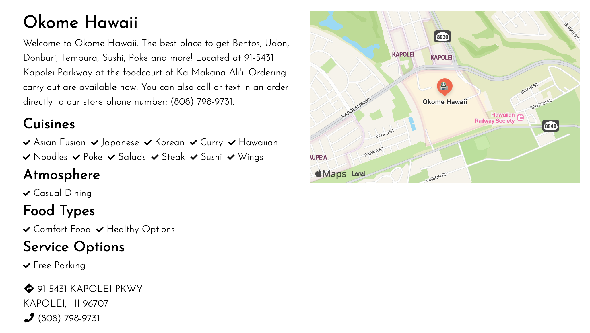
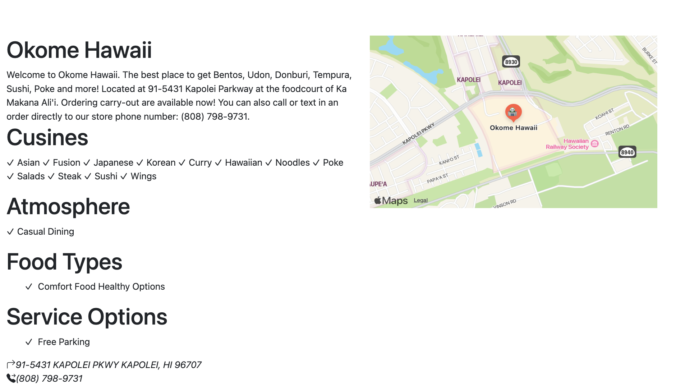

UI frameworks is probably something that many people look over just because it’s UI. Many developers are most likely more concentrated on the back end of things. However, how will that back-end code be used by the users without a user interface? Using UI frameworks such as Bootstrap helps make the process of creating the UI much more aesthetically pleasing. However, they can be almost as complicated to learn as a new programming language. However, UI is such an important part of a software or program.

## Bootstrap 5
One of the main advantages of using a UI framework like Bootstrap is that it drastically changes the amount of time that could be spent on trying to get it to look good. The framework offers a bunch of pre-designed components such as navigation bars, buttons, and more. Another big advantage of using Bootstrap is that they have cross-browser compatibility meaning that they can work across different browsers and devices to reduce the need to have a separate style for different browsers/devices. 

## My Experience
Personally, I thought that Bootstrap was hard and complex to use. This was my real first experience with UI. It was something that I was slow at first, but with the Bootstrap framework, I was able to see patterns and consistency with the different components that helped me code more efficiently. 

To help me practice Bootstrap, I attempted to recreate [this](https://okomehawaii.menufy.com/) website:

### Real Website:

### Recreation:

It's not 100% exact, but I think that I managed to create a very similar UI. Overall, this assignment was kind of fun and taught me a lot about how to use Bootstrap. 