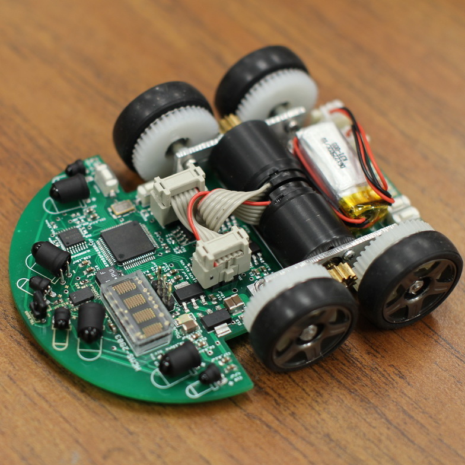

  
  
  

HTML was the first ever language I have learned. This project is what encouraged me to pursue a computer science degree. Through this mini project, I was able to learn and use basic HTML and CSS to create this quick and fun website to get to know me a little better! 

You can access the website through [here](http://www2.hawaii.edu/~yanosk/me/).
