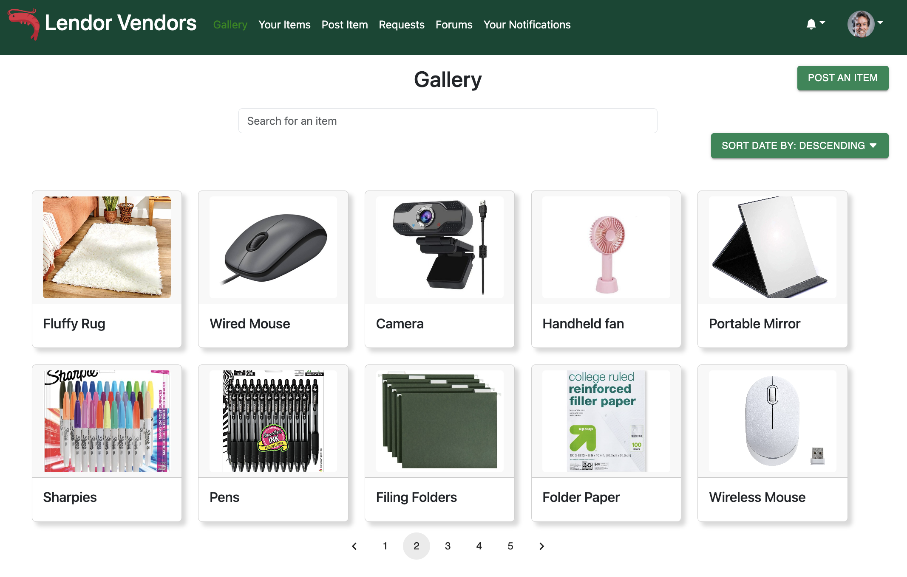
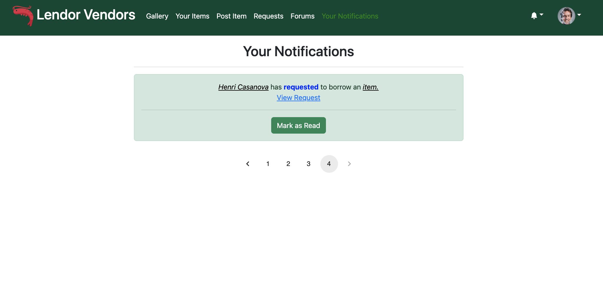
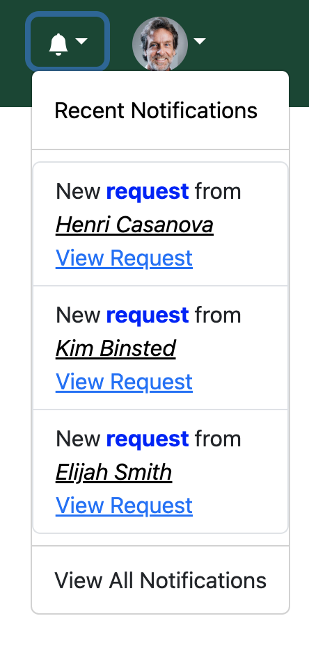

## Overview
Lendor Vendors is a web application that allows users to lend and borrow items from other users. The idea of the application is to save money and borrow items for free. If there is something you need there, but is not on the gallery page, we have a forum page where you can request for a specific item. Another feature we have is the ability to leave reviews. Users can leave reviews on other users to let others know how their experience was with them.

This web application was made for my final project for my software engineering class. It was a group project with 4 other people. We used Meteor, MongoDB , React. We managed our project using GitHub. You can view our projects GitHub page [here](https://github.com/lendor-vendors/lendor-vendors).

## My Contributions
One of the major parts I have contributed to was the notification system. My task to was to create a notification system so when a user's post got requested, they would get the notification. Or if a user's outgoing request got accepted/denied, they would also get a notification. I created a notification page where they can see all their notifications from most recent on top. The notifications would show 5 notifications at most then you would have to go to the next page to see your oldest notifications. 

I also made a notification dropdown that will show the most 3 recent unread notifications.

Other contributions I have made were creating the default data.

## What I Learned
This was my time working on a web application so everything was pretty new to me. Meteor and React were both very confusing to me at first, but once time went on, I was able to understand the structure and design patterns that are implemented in Meteor. I was also able to learn and practice software engineering concepts such as project management, configuration management and much more. I am greatful for this experience because it has taught me a lot about software engineering and how to work in a team. 

## Links
[Lendor Vendor Website](https://lendor-vendors.xyz/)

[GitHub Page](https://github.com/lendor-vendors/lendor-vendors)

